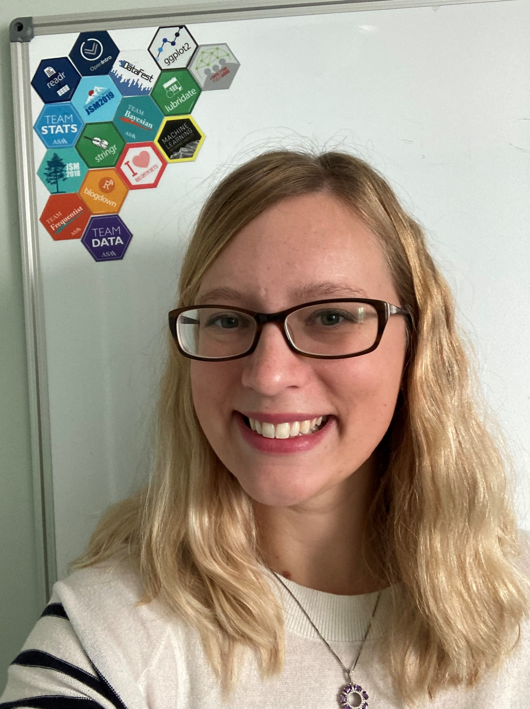

:::: {style="display: flex;"}

::: {}

```{r, echo=FALSE, out.width="80%", fig.align='center'}

```

:::

::: {}

Hi! My name is Aimee Schwab-McCoy and I am a Lecturer of Health Informatics and Statistics at the Institute of Technology Sligo (https://www.itsligo.ie/). I will be teaching courses in statistics, data mining, and biostatistics, as well as mentoring graduate students in Health Analytics.

I am also a certified RStudio Instructor, and an active researcher in statistics and data science education and curriculum development. 

My research interests include:

- Statistics education, especially including teaching and learning of biostatistics, data visualization, advanced modeling
- Data science education and curriculum development
- Spatial statistics and generalized linear mixed models in R
- Statistical consulting

My non-research interests include:

- 👨‍👩‍👦 Adventures with my son Link and husband Max
- 🏞️ Gardening and spending time outdoors
- 🎮 Gaming (especially Nintendo + PC)
- 📚 Reading

Find me online:

```{r, echo=FALSE, warning=FALSE, message=FALSE}
library(icons)
```

- `r fontawesome$solid$envelope` aimeeschwabmccoy "at" gmail.com 
- `r fontawesome('twitter')` @AimeeSMcCoy
- `r fontawesome('github')` @aimeeschwab-mccoy


For a full list of what I've been up to lately, check out my CV [here](files/AimeeSchwabMcCoy_CV.pdf).
:::

::::